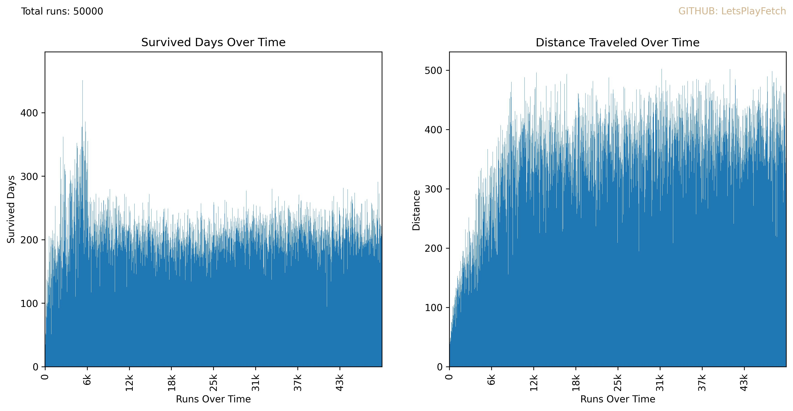

# OregonTrailMini

OregonTrailMini is a simple survival sim built to interact with reinforcement learning agents. I built this to be simple, readable, and easy to follow for people learning how RL(Reinforecent Learning) works.

---
## How to Run it 
 
Once you've cloned the repo, install Python 3, then run:
 
```bash
python3 OregonTrailMini.py
```
 
That’s it. It will automatically run simulations using Q-learning.
 
Once it finishes all simulations, it will output a file like:
 
```
training_results_00.csv
```


---
## What is Reinforecemnt Learning 
RL, for short, is a form of machine learnrning where an agent learns by taking an action, observing the result, and adjusting its strategy based on the reward or pentalty it receives. In our graph above you can see that it slowly optimized its chocies over time.

---
## How the game works

Every day, the agent (or player) picks one of three actions with corresponding effects:
- `travel`: might cause injury, moves forward
- `hunt`: might cause injury, might gain food
- `rest`: might heal

There goal is make it to end without dying and with the best speed possible.

You can build upon this logic, or change the effects of events here 
```OregonTrailMini.py
    if action == "rest":
        if s["health"] < 5:
            if random.random() < 0.5:
                s["health"] += 1

    elif action == "hunt":
        s["food"] += random.randint(5, 15) # Food found while hunting 
        if random.random() < 0.3: # Possibility of injury
            s["health"] -= 1

    elif action == "travel":
        dist = random.randint(5, 15)
        s["distance"] += dist
        s["events"].append(f"Traveled {dist} miles.")
        if random.random() < 0.1:
            s["health"] -= 1
```


Below it validates if the game is over and steps to the next day
Run out of health, lose. 
Make it to the end, win.

- **HEALTH**: - Is tracked on a scale from 0-5, if it reaches 0 player dies

In addition to this, you also have starting defined in the main OregonTrailMini class. You can adjust length and starting resource values here

```OregonTrailMini.py
def reset(self):
    self.state = {
        "day": 0,         # for counting
        "distance": 0,    #    ``
        "goal": 500,
        "food": 10,
        "health": 5,
        "alive": True,
        "events": []
    }
```

\
---
## How RandomAgent Works
The agent uses Q-learning.
In RandomAgent.py we define our Q-learning class. It’s again straight forward. choose_action is how we decide the next move
```
def choose_action(self, state):
    state_key = self._state_to_key(state)
    if random.random() < self.epsilon or state_key not in self.q_table:
        return random.choice(self.actions)
    return max(self.q_table[state_key], key=self.q_table[state_key].get)
```

The learn function is what handles updating the q table. It loads our current state variables , the choice made, and the reward. Then it checks if we’ve ever taken an action from that spot before; if not, it gets added it to the table. After that, it grabs the current Q-value for the action and compares it to the max possible Q-value from the next state. These two values get blended to update the Q-table, helping the agent remember what worked and improve next time.

```python
def learn(self, state, action, reward, next_state):
    state_key = self._state_to_key(state)
    next_key = self._state_to_key(next_state)

    if state_key not in self.q_table:
        self.q_table[state_key] = {a: 0.0 for a in self.actions}
    if next_key not in self.q_table:
        self.q_table[next_key] = {a: 0.0 for a in self.actions}

    current_q = self.q_table[state_key][action]
    max_future_q = max(self.q_table[next_key].values())
    updated_q = current_q + self.lr * (reward + self.df * max_future_q - current_q)

    self.q_table[state_key][action] = updated_q
```

You set the number of trials or episodes here in
OregonTrailMini.py
```python
if __name__ == "__main__":
    game = OregonTrailMini()
    agent = QLearningAgent(actions=["rest", "hunt", "travel"])
    game.run_agent(agent, episodes=100000)
```


##### Reward System
The reward system is... simple. Only get points when youve won or lost. You cann add or subract rewards at any point in the code, i.e. reward progress, punish pointless rest days etc.
 
 - **Dying is very bad**: -1000 points
 - **Winning is very good**: Up to +1000, scaled by how fast you made it
 - **Faster win is better**: Getting there fast matters (-1 point per day)
 ```OregonTrailMini.py
    if s["health"] <= 0:
    s["alive"] = False 
        reward -= 1000

    if s["distance"] >= s["goal"]:
        s["alive"] = False       # Changing state to dead is how the game ends
        s["events"].append("You reached your goal!")
        reward += 5000 - (s["day"] * 1)

    return s.copy(), reward, not s["alive"], {}
```

# Results


## Planned addition 
 - I want to add a more dynamic difficulty system.  
 - Rewards will better reflect progress — for example, dying still gives -1000 even if you were close to finishing.
 - Implement pickle
 - Fix death colloum to show reson of death (more advance game tracking stuff)

## Feedback
 Known Bug: Aware that theres a problem 
I'm actively looking to make improvements to the game specifically its difficulty balance.
 
If you have ideas, thoughts, or suggestions, feel free to reach out to me on GitHub.